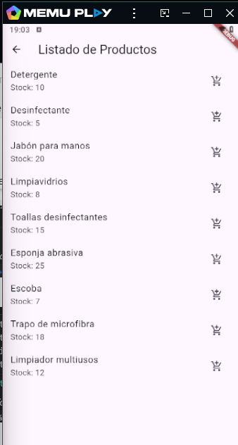
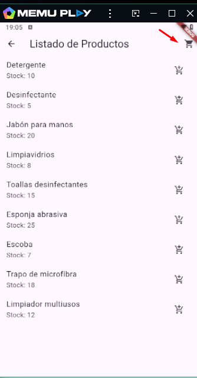
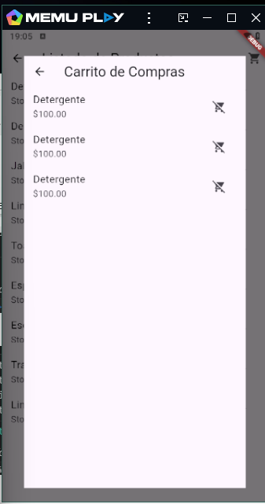

# Desarrollo de Aplicaciones Móviles

En un pequeño negocio de venta de artículos para el hogar, se
desea una aplicación móvil que permita que
los clientes puedan adquirir los productos del negocio sin necesidad
de visitar la tienda de manera presencial.
Para dar cumplimiento con las necesidades de este negocio, usted a
partir de una aplicación base le agregará las funcionalidades
necesarias para obtener una aplicación que satisfaga dichas necesidades.

❖ El proyecto base cuenta con las pantallas: Home, Listado de
Productos y Detalles del Producto.

## Capturas de Pantalla

